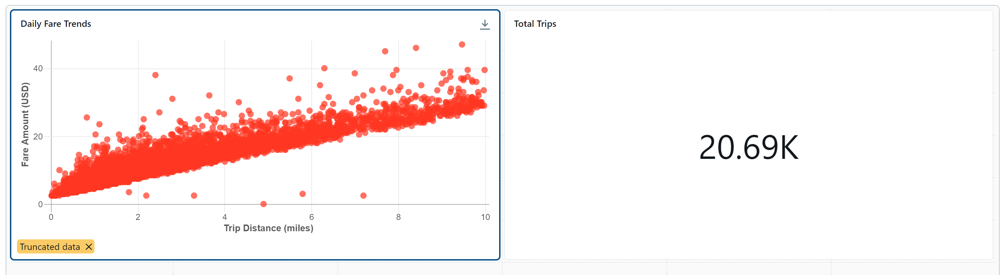

# Virtual Machine (VM) Exercises

## 1st VM Exercise

#### Dataset

- [x] Add datasets used to the `datasets/` folder - This exercise is using the internal Databricks sample dataset samples.nyctaxi.trips

#### Files

- [x] **Initial**: Add file to the `exercises/`  folder with the name `ex-1-initial.sql`. 
- [x] **Solution**: Add file to the `exercises/`  folder with the name `ex-1-sol.lvdash.json`.

#### Learning Objective

*Create a new dashboard by combining visulizations*

#### Context

*Learning to create a Databricks dashboard is crucial as it equips you with the ability to visualize and interpret complex data efficiently. This skill is integral to data-driven decision-making, enabling you to derive actionable insights from large datasets. In real-life scenarios, a Databricks dashboard can track key performance indicators (KPIs) and monitor important metrics in real time. This practical tool helps in identifying patterns, optimizing processes, and ultimately driving strategic initiatives with data-backed evidence.*

#### Steps to be executed by the student (max 6)

*Each bulleted instruction is a complete sentence that describes a specific task.*

- Step 1: Run the provided query in Databricks "SQL Editor".
- Step 2: Create a scatter plot visualization named "Daily Fare Trends" with "trip_distance" as the x-axis and "fare_amount" as the y-axis.
- Step 3: Create a counter plot named "Total Trips" using "Count rows" as the target value.
- Step 4: Add both visualizations to a new dashboard named "Trips".
- Step 5: Change the dot color to red in the "Daily Fare Trends" widget in your dashboard.

#### Exercise question:
*Question: What is the total trips count displayed on the dashboard? Answer: 20.69K*

#### End goal:

## 2nd VM Exercise

#### Dataset

- [x] Add datasets used to the `datasets/` folder - This exercise is using the internal Databricks sample dataset samples.nyctaxi.trips

#### Files

- [x] **Initial**: Add file to the `exercises/`  folder with the name `ex-2-intial.lvdash.json`.
- [x] **Solution**: Add file to the `exercises/`  folder with the name `ex-2-sol.lvdash.json`.

#### Learning Objective

*Edit the dashboard*

#### Context

*Learning how to edit Databricks dashboards is essential for efficiently organizing and presenting data insights. Being proficient in tasks such as moving, resizing, adding, and deleting widgets empowers individuals to customize dashboards according to specific analytical needs and audience preferences. By effectively managing widgets, users can highlight key metrics, streamline data visualization workflows, and ultimately facilitate better decision-making processes based on actionable insights derived from the data.*

#### Steps to be executed by the student (max 6)

*Each bulleted instruction is a complete sentence that describes a specific task.*

- Step 1: Remove the widgets "Total Trips" and "Route Revenue Attribution".
- Step 2: Re-position the widget "Daily Fare Trends" to the bottom of the dashboard.
- Step 3: Resize the widget "Daily Fare Trends" to fill the dashboard horizontally.
- Step 4: Update the axis labels of "Daily Fare Trends" to display "Trip Distance (miles)" and "Fare Amount (USD)".
- Step 5: Include a Markdown style "Heading 1" description "NYC Taxi Trip Analysis" at the top of the dashboard.

#### Exercise question:
*Question: From the dashboard, what is the highest daily fare amount recorded in February 2016? Answer: 45*

#### End goal:

